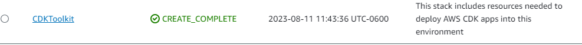

# Create EC2 Instance in new VPC with Systems Manager enabled

This example includes:

* Own VPC with public subnet (following AWS Defaults for new accounts)
* Based on latest Amazon Linux 2
* System Manager replaces SSH (Remote session available trough the AWS Console or the AWS CLI.)
* Userdata executed from script in S3 (`configure.sh`).

The `cdk.json` file tells the CDK Toolkit how to execute your app.

This project is set up like a standard Python project.  The initialization
process also creates a virtualenv within this project, stored under the `.venv`
directory.  To create the virtualenv it assumes that there is a `python3`
(or `python` for Windows) executable in your path with access to the `venv`
package. If for any reason the automatic creation of the virtualenv fails,
you can create the virtualenv manually.

## Prerequisites

* Python
* Aws cli
* Node.js
* Lastest pip upgrade and install virtualenv
```
python -m ensurepip --upgrade
python -m pip install --upgrade pip
python -m pip install --upgrade virtualenv
```
* Install aws-cdk with npm

    `npm install -g aws-cdk`

Preferably install the latest stable versions of the software, otherwise you can run into runtime errors.

For reference this are the versions I used for this example:

* Python 3.11.4
* Aws cli 2.9.12
* Node.js 9.6.7

## Steps to create project

Create project folder

```
md app-project
```

Go inside the directory and initialize it

```
cd app-project
npx cdk init app --language python
```

## Deploy stack

To work with the new project, activate its virtual environment. This allows the project's dependencies to be installed locally in the project folder, instead of globally.

```
source .venv/bin/activate
```

Install the apps dependencies

```
python -m pip install -r requirements.txt
```

For setting up your cli aws credentials you can check [here](https://docs.aws.amazon.com/cli/latest/userguide/cli-chap-configure.html) for reference, and set the region you want your resoures to be deployed [aws cdk documentation](https://docs.aws.amazon.com/cdk/v2/guide/cli.html#cli-environment).

Note: as I'm running in windows with brillio limited access, I use ``npx`` before each cdk sentence, so I can access the cdk package [see here for more info](https://docs.aws.amazon.com/cdk/v2/guide/work-with-cdk-javascript.html#typescript-local).

Synthesize your template, this can give you any syntactic or logical error.

```
npx cdk synth
```

If this is the first time you use CDK in your aws account, first you need to deploy the CDK Toolkit staging stack [see](https://docs.aws.amazon.com/cdk/v2/guide/bootstrapping.html)

```
npx cdk bootstrap
```



Then you can deploy your stack

```
npx cdk deploy
```


Finally, to clean up your resources

```
npx cdk destroy
```


## Useful commands

 * `cdk ls`          list all stacks in the app
 * `cdk synth`       emits the synthesized CloudFormation template
 * `cdk deploy`      deploy this stack to your default AWS account/region
 * `cdk diff`        compare deployed stack with current state
 * `cdk docs`        open CDK documentation

